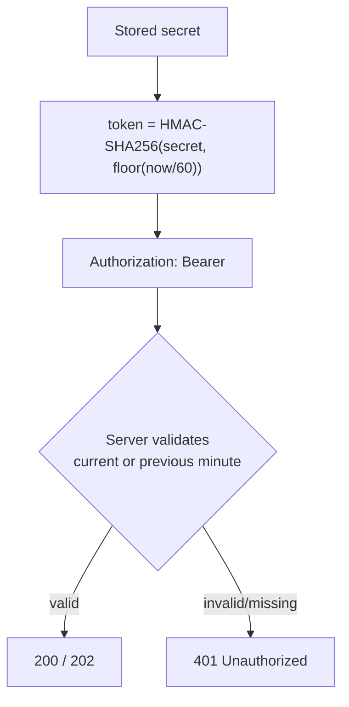

# Authentication

Every endpoint except `GET /` and `POST /api/connect` requires a Bearer token
derived from a shared secret. This page is the reference for the scheme;
[Getting started](getting-started.md) walks through it with runnable code.

## 1. Obtain a shared secret (pairing)

Pair once via `POST /api/connect` (localhost only). Send an application name and
the [capabilities](capabilities.md) you need:

```json
{ "application_name": "My Tool", "capabilities": ["project", "upload"] }
```

The user is shown a consent dialog naming your application and the requested
capabilities. On approval you receive a secret:

```json
{ "status": "ok", "secret": "aB3dE7fG9hJ1kL5m" }
```

Notes:

- The dialog times out and declines after **30 seconds** (`403`).
- An empty or unknown capability list is rejected (`400`) before any dialog.
- Capabilities are **immutable for the life of the secret**. To change scope,
  pair again.
- Each call produces a **distinct** secret. You are responsible for persisting
  your own secret securely.

### Clients that run on another machine

`POST /api/connect` is localhost-only, and returns the secret in its response
body over plain HTTP — which is exactly why it isn't reachable from the
network. A client running elsewhere therefore cannot pair itself.

Provision it in two steps instead:

1. Pair once on the machine running LightBurn / MillMage — either from a local
   tool, or with any HTTP client (`curl`) against `localhost`.
2. In the application, open **Manage authorizations**, select the entry, and
   choose **Show Secret**. Transfer it to the other machine over a channel you
   trust.

The secret is not machine-bound: once issued it works from anywhere the
listener is reachable. Treat it as a password in transit — revoke it from the
same dialog if it is ever exposed.

## 2. Derive a Bearer token

The token is an HMAC-SHA256 of the current Unix minute, keyed by the secret,
hex-encoded:

```
token = hex(HMAC-SHA256(secret, floor(unix_time / 60)))
```

The server accepts tokens for the **current and previous minute**, tolerating up
to ~1 minute of clock drift. Compute a fresh token per request (cheap) or cache
it per minute.

```python
import hmac, hashlib, time

def bearer_token(secret: str) -> str:
    message = str(int(time.time()) // 60).encode()
    return hmac.new(secret.encode(), message, hashlib.sha256).hexdigest()
```

## 3. Send it

```
Authorization: Bearer <token>
```



## Failure modes

| Situation | Response | What to do |
|-----------|----------|------------|
| Missing or malformed token | `401` | Recompute the token; check the clock |
| Token for an expired minute | `401` | Recompute (clock drift > 1 min) |
| Secret revoked / stale | `401` | Discard the secret and re-pair |
| Endpoint outside granted scope | `401` | Re-pair with the needed capability |
| Request from off-machine while network access is off | `401` | Enable network access in the app, or call from localhost |
| `POST /api/connect` from off-machine | `403` | Pair on the machine running the app |
| Pairing declined or timed out | `403` | Prompt the user and retry `POST /api/connect` |

Note the first four are **deliberately indistinguishable**. Every
authorization failure on a gated endpoint returns a bare `401`, whether the
token is absent, expired, revoked, lacking the capability, or arriving from a
disallowed origin. The API does not tell an unauthenticated caller which of
those it is, so don't branch on the reason — on any `401`, recompute the token
once, and if it persists, re-pair.

## Security notes

- Treat the secret like a password. Store it per-application, not in shared
  locations.
- The API is loopback-only by default. Exposing it to a network widens the
  attack surface — see [`../SAFETY.md`](../SAFETY.md) and
  [`../SECURITY.md`](../SECURITY.md).
- The token is time-based, not a bearer secret in transit beyond its minute
  window, but it is still sensitive — do not log it.
