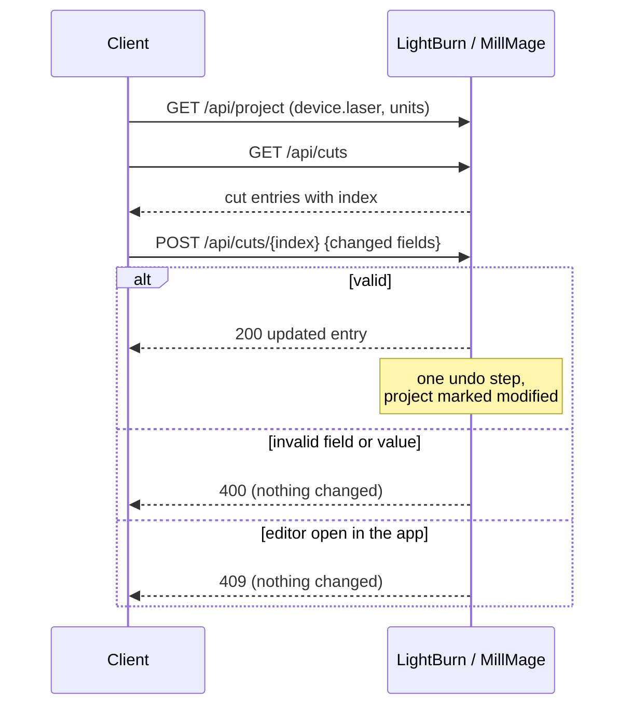

# Cut settings

Cut settings are the per-layer parameters (LightBurn) or per-operation
parameters (MillMage) that decide how a project is output. The API can read
them with the `project` [capability](capabilities.md) and change them with
`project_write`.

| Endpoint | Capability | Behavior |
|----------|------------|----------|
| `GET /api/cuts` | `project` | Every cut entry in the project |
| `GET /api/cuts/{index}` | `project` | One cut entry, bare (not wrapped) |
| `POST /api/cuts/{index}` | `project_write` | Partial update of one cut entry; returns the updated entry |

A client that edits cuts normally needs both: `project` to find the entry and
its current values, `project_write` to change it.

```json
{ "application_name": "My Tool", "capabilities": ["project", "project_write"] }
```

## Reading cuts

`GET /api/cuts` returns a product-specific payload. Dispatch on the `product`
field: `lightburn` returns laser cuts, `millmage` returns CNC operations.

Every entry carries an `index` — a dense, global `0..N-1` position in the
returned array. That `index` is the value to use with `/api/cuts/{index}`, for
both `GET` and `POST`.

### LightBurn

The list is **fixed-size**, whether or not the layers are in use:

| Position | Entries | Notes |
|----------|---------|-------|
| First | 30 cut layers | `kind: "normal"` |
| Next | 2 tool layers | `kind: "normal"`, `mode: "tool"` — not editable |
| Next | 1 internal virtual-array cut | `layer_index: -1` — not editable |
| Last | 30 image cuts | `kind: "image"` |

`index` and `layer_index` are different things: `index` is the entry's
position in this list, `layer_index` is the layer slot on the desktop. To find
the layers that are actually in use, read `GET /api/layers` and filter on
`in_use == true`.

Each normal cut reports its base layer in `mode` and `params`
(`LaserCutParams`: speed, power, passes, frequency, …). Any additional
sub-layers are in `sub_layers`, each with its own `index` (starting at `1`;
the base layer is `0`), `name`, `enabled`, `mode` and `params`. The base layer
is not repeated in `sub_layers`.

#### Which laser fields apply

`LaserCutParams` always includes the source and pulse fields — dual-source
power (`min_power_2`, `max_power_2`, `laser1_enabled`, `laser2_enabled`),
`alt_source`, `q_pulse_width` and `fiber_pulse_width` — whether or not the
connected device uses them. Read `device.laser` from `GET /api/project` to
decide which are meaningful:

| `device.laser` field | Enables |
|----------------------|---------|
| `sources` / `sources_enabled` = 2 | Dual-source fields (`*_power_2`, `laser1_enabled`, `laser2_enabled`) |
| `galvo` | `alt_source` |
| `mopa_source` ≠ 0 | `q_pulse_width` (MOPA pulse width, ns) |
| `laser1_fiber` / `laser2_fiber` | `fiber_pulse_width` (gantry fiber, ns) |

LightBurn does not classify a device as CO2, diode or fiber in general;
`device.laser.controller` (e.g. `Ruida`) is provided so clients can infer it.

### MillMage

`cuts` is the project's **operation list, in order**, and `index` is the
operation's position in it. Operations attach to shapes rather than layers, so
there is no `layer_index`; `shape_count` gives the number of shapes the
operation is assigned to (`0` means unused). Operations run in list order, so
there is no `priority` either.

Each operation reports:

- `operation` — the operation type (`profile`, `pocket`, `vcarve`, …).
- `tool` — the assigned tool's name, diameter, feed/plunge rates and spindle
  RPM.
- `settings` — every stored property of the operation, keyed by name (e.g.
  `passDepth`, `feedRate`, `stepOver`, `cutDirection`, `vacuum`, `coolant`).
  The set depends on the operation type and can include properties the
  operation dialog doesn't show for that type. Enum properties are names, e.g.
  `cutDirection: "climb"`.
- `shared_fields` — `settings` keys taken from a linked primary operation
  (e.g. `startDepth`, `finalDepth`). Their values are the primary's. Empty if
  the operation isn't linked.

## Units

| Values | Units |
|--------|-------|
| LightBurn cut values | The user's display units |
| MillMage `tool` block | The user's display units |
| MillMage `settings` | Always mm and mm/s |

Read the display units from `GET /api/units` or `units` on `GET /api/project`.
`POST` takes values in the same units `GET` reports.

## Changing a cut

`POST /api/cuts/{index}` changes one entry. Send only the fields you want to
change; everything else is left as it is.

```python
import json, urllib.request

body = {
    "params": {"speed": 150, "max_power": 65},
    "sub_layers": [{"index": 1, "enabled": False}],
}
req = urllib.request.Request(
    "http://localhost:19520/api/cuts/3",
    data=json.dumps(body).encode(),
    method="POST",
    headers={
        "Authorization": f"Bearer {bearer_token(secret)}",
        "Content-Type": "application/json",
    },
)
updated = json.load(urllib.request.urlopen(req))   # same shape as GET /api/cuts/3
```



### What can be changed

**LightBurn, `kind: "normal"` cuts:**

- `name`, `enabled`, `mode` (`cut`, `scan` or `offset`)
- `params` — any `LaserCutParams` field
- existing `sub_layers`, addressed by their `index`: `name`, `enabled`, `mode`,
  `params`. Sub-layers can't be added or removed.

**LightBurn, `kind: "image"` cuts:**

- `name`, `enabled`
- `params.speed`, `params.max_power`, `params.dither_mode` (one of the strings
  `GET` reports, e.g. `Stucki`), plus the source and pulse fields
- `dpi` is read-only.

Value ranges: powers (including `*_power_2`) are `0`–`100`; `q_pulse_width`
must be greater than `0`; `fiber_pulse_width` must be a positive integer.

Tool layers and the internal virtual-array cut are rejected with `400`.

**MillMage operations:**

- `name`, `enabled`
- any `settings` key the operation reports, with the same JSON type (enums by
  name)
- `shared_fields` can only be changed on the linked primary operation; sending
  them to a linked secondary is rejected.
- The operation's type, tool and shapes can't be changed.

On MillMage, the `index` in the response can differ from the one in the
request if the change re-sorts a linked chain. Use the returned `index` for
any follow-up calls.

### How a change is applied

- **All or nothing.** The whole body is validated before anything changes. If
  any field or value is invalid, the response is `400` and the project is left
  untouched.
- **Undoable.** A successful change is a single undo step in the application
  ("Change cut settings") and marks the project as modified.
- **Not while editing.** If the cut settings or operation editor is open in
  the application, the request fails with `409`. Ask the user to close it and
  retry.
- **Running jobs.** Changes are allowed while a job is running, but they don't
  affect a job that has already been sent to the machine. They apply the next
  time the project is output.

### Responses

| Status | Meaning |
|--------|---------|
| `200` | Updated; the body is the updated entry, same shape as `GET /api/cuts/{index}` |
| `400` | Invalid body, field, or value, or the entry isn't editable — nothing changed |
| `401` | Authorization failure, including a token without `project_write` |
| `404` | `index` out of range |
| `409` | The cut settings / operation editor is open in the application |

## Safety

Cut settings control laser power, speed, feed rates and other parameters that
directly affect how a machine behaves. Validate values before sending them,
test changes on non-critical material, and have the operator review settings
before a job runs. See
[API-Modified Job Settings](../SAFETY.md#api-modified-job-settings).

See [`openapi.yaml`](openapi.yaml) for the full request and response schemas.
