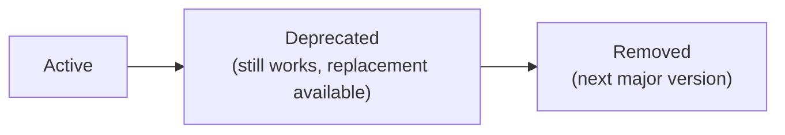

# Deprecations

This page lists API functionality that is deprecated — scheduled for removal or
replacement — along with migration guidance. It works hand in hand with
[Versioning](versioning.md).

## Current deprecations

**None.** There are no deprecated endpoints, fields, or behaviours at this time.

## How deprecation will work

When functionality is slated for removal, LightBurn Software intends to follow a
predictable lifecycle:

1. **Announce** — the item is marked deprecated here and in
   [`../CHANGELOG.md`](../CHANGELOG.md), with the reason and a recommended
   replacement.
2. **Overlap** — the deprecated item keeps working alongside its replacement for
   a transition period, so integrations can migrate without downtime.
3. **Remove** — the item is removed, no earlier than the next **major** API
   version (see [Versioning](versioning.md)). Removal is recorded in the
   changelog.



Where practical, deprecated responses may also carry an in-band signal (for
example a `Deprecation` or `Warning` header) so clients can detect usage
programmatically. _(Proposed — not yet implemented.)_

## What this does and doesn't cover

- **Covered:** publicly documented endpoints, fields, and behaviours.
- **Not covered:** undocumented, internal, experimental, or reverse-engineered
  functionality. These are unsupported and may change or disappear at any time
  without a deprecation notice — see [`../POLICY.md`](../POLICY.md).

## When deprecations appear here

Each entry will use this format:

```
### <name> — deprecated in <version>, removed in <version>
What changed, why, and the recommended replacement with a short example.
```

Until then, watch [`../CHANGELOG.md`](../CHANGELOG.md) for the first entries.
