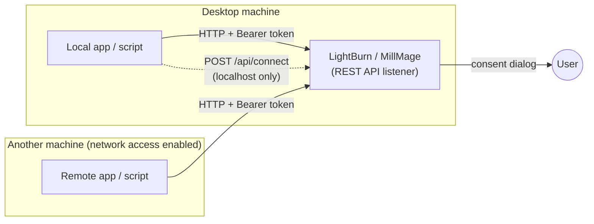
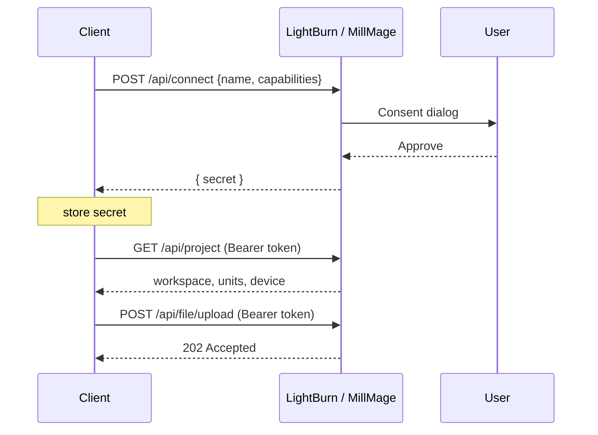

# API Overview

The LightBurn / MillMage REST API is an HTTP interface exposed by the desktop
applications. It lets external programs read application and machine state,
read project data, and submit files for import — over plain HTTP, on the
loopback interface by default.

This page is the conceptual map. For step-by-step usage see
[Getting started](getting-started.md); for the exhaustive contract see
[`openapi.yaml`](openapi.yaml).

## Where the API lives

The API is served by the running desktop application — there is no separate
server to start. It listens whenever the app is open:

| Application | Base URL |
|-------------|----------|
| LightBurn   | `http://localhost:19520` |
| MillMage    | `http://localhost:19521` |

These ports are fixed per product — there is no setting to change them.

The API binds to the loopback interface by default. To reach it from another
machine, enable **Settings → Extensions → Allow API Access From Network** in
the desktop application; the listener then accepts connections on any
interface. On Windows this may prompt once for a firewall rule.

Pairing is the exception: `POST /api/connect` is **always** restricted to
localhost, even with network access enabled, and returns `403` otherwise. A
remote client must therefore be paired locally first, then use the resulting
secret from wherever it runs. See [Authentication](authentication.md).

## How a client interacts

1. **Pair once** — `POST /api/connect` with an application name and the
   capabilities you need. The user approves a consent dialog; you receive a
   shared secret. Persist it.
2. **Authenticate every request** — derive a short-lived Bearer token from the
   secret (HMAC-SHA256 over the current minute). See
   [Authentication](authentication.md).
3. **Call endpoints** within your granted capabilities — read state, read
   project data, or upload files.

## Capabilities

Access is scoped at pairing time to one or more capabilities. Request only what
you need. See [Capabilities](capabilities.md) for the per-endpoint breakdown.

| Capability | Grants |
|------------|--------|
| `state`   | Read-only machine and job state (status, position, units, events) |
| `project` | Read-only project data (project, layers, cuts, material library) |
| `upload`  | Submit files for import (`/api/file/upload`, `/api/file/open`) |

## What the API is for

- Reading application and machine state
- Querying project and material information
- Submitting designs for import
- Building companion apps, automation, and workflow integrations

## What the API is not

- **Not a machine-control interface.** The public API does not expose endpoints
  that move or operate machinery.
- **Not a safety system.** See [`../SAFETY.md`](../SAFETY.md).
- **Not version-stable yet.** Behaviour may change between application
  releases — see [Versioning](versioning.md).

## Real-time updates

State changes are available two ways: a Server-Sent Events stream
(`GET /api/events`) and a polling fallback (`GET /api/events/poll`). Import
results arrive as a `file_imported` event after an upload.

## Next steps

- [Getting started](getting-started.md) — pair, authenticate, first call
- [Authentication](authentication.md) — the token scheme in detail
- [Capabilities](capabilities.md) — scopes and endpoints
- [Uploading files](uploading.md) — import and placement
- [API reference](api-reference.md) — every endpoint
- [Versioning](versioning.md) — how the API will evolve
