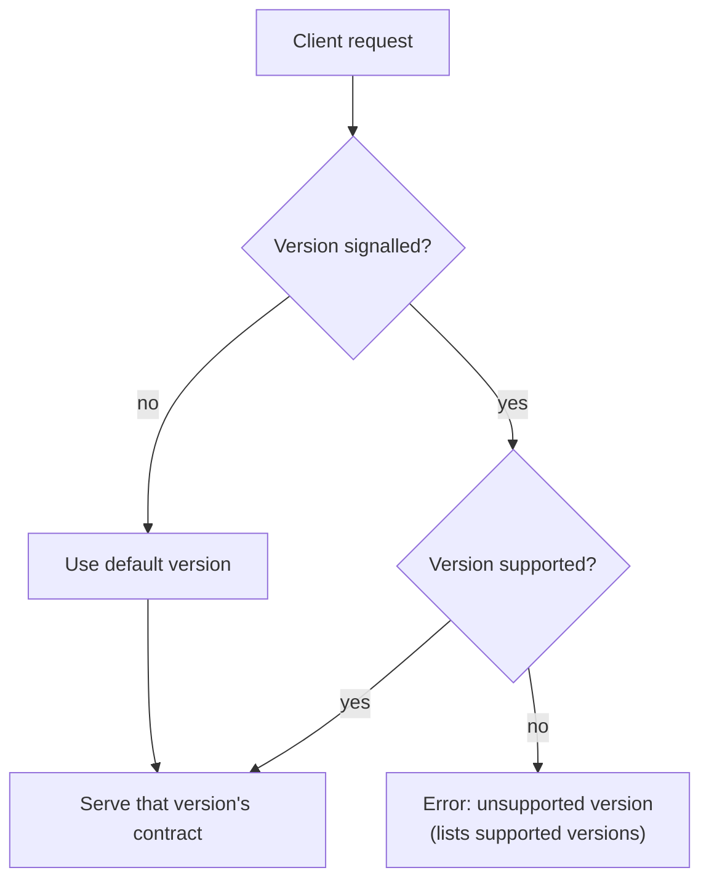

# Versioning

> **Status: planned — not yet implemented.**
> This page describes the versioning model LightBurn Software intends to
> introduce. The current API does **not** yet expose a version negotiation
> mechanism. The specification is published at `1.0.0` as a baseline. Details
> below marked _(proposed)_ are subject to change before they ship.

## Why versioning

The REST API evolves alongside LightBurn and MillMage. Endpoints, request and
response shapes, authentication, and available functionality may change between
application releases. Versioning gives integrators a stable contract to build
against and a predictable path when things change.

## Principles

These commitments will hold once versioning ships:

- **The specification is the contract.** Each API version corresponds to a
  published `openapi.yaml`. If it isn't documented, it isn't part of the version.
- **Semantic intent.** Versions communicate the *kind* of change:
  - **Major** — backward-incompatible changes (removed/renamed endpoints or
    fields, changed semantics, stricter validation).
  - **Minor** — backward-compatible additions (new endpoints, new optional
    fields, new enum values).
  - **Patch** — documentation clarifications and fixes with no behavioural change.
- **Additive changes are not breaking.** Clients must ignore unknown fields and
  tolerate new enum values, so minor versions don't break them.
- **Deprecate before removal.** Functionality slated for removal is marked
  deprecated first, with migration guidance — see [Deprecations](deprecations.md).
- **No silent breakage.** Breaking changes arrive only with a major version and
  are recorded in [`../CHANGELOG.md`](../CHANGELOG.md).

## How a client will select a version _(proposed)_

The exact mechanism is not finalised. The leading approach is an explicit,
opt-in version signal so that an unversioned client keeps getting a stable
default:

- A request header (e.g. `X-API-Version: 1`), **or**
- a version prefix in the path (e.g. `/api/v1/...`).

Expected behaviour once chosen:

- **Omitted** → the server assumes a documented default version (initially `1`).
- **Supported** → the server honours that version's contract.
- **Unsupported** → the server responds with a clear error (e.g. `400`) naming
  the versions it does support, rather than failing obscurely.

> The choice between header and path prefix, and the precise error shape, are
> open decisions. This section will be updated when they are settled.

## Discovering the version _(proposed)_

A lightweight, unauthenticated way to discover the running API version (for
example a `version` field on an existing metadata response, or a dedicated
endpoint) is planned so clients can adapt at runtime. Not yet available.

## Relationship to application versions

The API version is **not** the LightBurn or MillMage application version. One
application release may ship a given API version; a later release may keep the
same API version (no contract change) or introduce a new one. The mapping will
be recorded in [`../CHANGELOG.md`](../CHANGELOG.md).

## Guidance for integrators

- **Test against the versions you support**, and state them (e.g. "compatible
  with LightBurn REST API v1") — see [`../CERTIFICATION.md`](../CERTIFICATION.md).
- **Be liberal in what you accept**: ignore unknown fields, tolerate new enum
  values, don't assume field order.
- **Watch the changelog** for deprecations and new versions.
- **Don't depend on undocumented behaviour** — it is not covered by any version
  guarantee and may change without notice.

## Current state, concretely

Until versioning ships:

- There is one published specification, `1.0.0`.
- No version header or path prefix is required or honoured.
- Treat the current API as **pre-stable**: it may change between application
  releases without a version bump. Pin your testing to the application versions
  you support.
